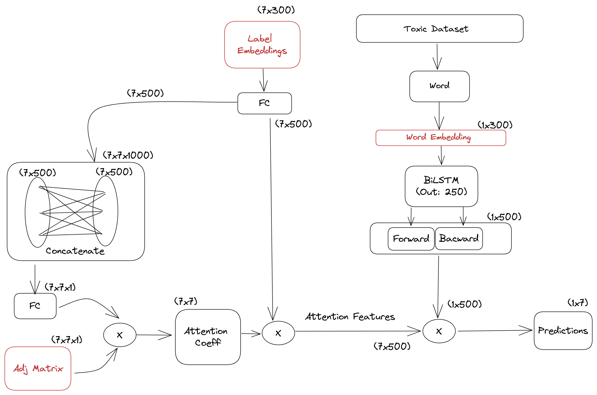

# MAGNET-Multi-Label-Text-Classi-cation-using-Attention-based-Graph-Neural-Network

## Description

This GitHub repository provides an implementation of the paper "**MAGNET**: Multi-Label Text Classification using Attention-based Graph Neural Network". MAGNET is a state-of-the-art approach for multi-label text classification, leveraging the power of graph neural networks (GNNs) and attention mechanisms.

You can refer [paper](https://arxiv.org/abs/2003.11644).

If you are unable to render Notebook on github, then alternatively,you can view it [here](https://nbviewer.org/github/akash18tripathi/Clustering-Exploration-on-Fashion-MNIST/blob/main/Clustering%20Exploration.ipynb)

# MAGNET-Architecture

The architecture can be broken down into 3 parts:

## Part 1: Pretrained Embeddings and BiLSTM Layer

In this part, the architecture utilizes pretrained word embeddings. These embeddings capture semantic information about the words in the input text. The embeddings are fed into a Bidirectional Long Short-Term Memory (**BiLSTM**) layer, which processes the input text in both forward and backward directions. The outputs of the forward and backward LSTM layers are concatenated to create a combined representation.

## Part 2: Attention mechanism

This part involves handling the **label embeddings**. The label embeddings are passed through a Fully Connected (FC) layer, which transforms them into a suitable representation. The outputs of the FC layer are then pairwise concatenated, resulting in a three-dimensional matrix of pairwise label features. This matrix is further processed by another FC layer to reduce the third dimension. To obtain attention coefficients, the resulting matrix is multiplied element-wise with the **adjacency matrix**, which is constructed using the ground truth labels. This process is repeated multiple times for Multiheaded Attention, allowing the model to capture different aspects of label relationships.These attention Coefficients are then multiplied with the output of FC layer to obtain Attention features.

## Part 3:Prediction and Label Correlations

In this final part, the outputs from both Part 1 and Part 2 are combined. A dot product operation is performed between the representations obtained from the previous parts. This dot product operation captures the interactions and correlations between the text features and label features. The resulting predictions contain not only individual label predictions but also the correlations among the labels.

## Architecture Diagram

# Hyperparameters

### Embeddings

- Pretrained embeddings (Glove, BERT, Word2Vec) are crucial for architecture initialization and performance.
- **Glove** and Word2Vec embeddings perform similarly, capturing semantic meaning from large-scale training.
- **BERT** embeddings capture more detailed and context-dependent information.
- BERT embeddings outperform Glove and Word2Vec, indicating their benefit for the specific architecture.
- Leveraging advanced language models like BERT improves results in capturing nuanced semantic relationships.

### Adjacency Matrix Initialization

- Adjacency matrix initialization in MAGNET is an important step for capturing label relationships.
- The Adjacency matrix represents the connections between different labels.
- In the MAGNET paper, the ground truth labels are used to construct the initial Adjacency matrix.

- **Random Initialization**: Random initialization assigns random values to the adjacency matrix. It is commonly used when there is no prior knowledge about the optimal parameter values.

- **Cooccurrence Initialization**: Cooccurrence initialization leverages label cooccurrence patterns in the training data. The adjacency matrix, representing label connections, is initialized based on label cooccurrence. A value of 1 is assigned if two labels cooccur in the same document, indicating a relationship.This initialization helps the model capture label relationships effectively.
  
- **Xavier's Initialization**: It scales the initial values based on the size of the input and output layers to ensure that the variance of the activations remains constant across layers.
  
In MAGNET, it was expected that Cooccurrence initialization would outperform Random initialization. However, surprisingly, Random initialization performed better.

# Datasets

- The [Toxic Comment dataset](https://www.kaggle.com/competitions/jigsaw-toxic-comment-classification-challenge/data) is a large-scale dataset available on Kaggle.
- It consists of numerous online comments labeled for toxicity, including  6 categories such as toxic, severe toxic, obscene, threat, insult, and identity hate.
- The dataset provides multi-label classification, enabling comments to have multiple toxicity labels simultaneously. It contains a substantial number of rows, offering ample data for training and evaluation.
- However, it exhibits class imbalance, meaning that certain toxicity categories may be underrepresented compared to others. This requires careful handling and consideration of class distribution during model training to ensure accurate classification across all toxicity types. 

- I have also performed similar analysis on **Reuters** Dataset which consists of 90 labels.

# Model Comparisons

- I have implemented 4 types of models for comparing the results and performance:

1. Classical Models:
   - Binary Relevance
   - Classifier Chains
   - OnevsRest
   - Hierarchical SVM

2. Neural Models:
   - BiLSTM with Glove embedding
   - CNN with Glove embedding
   - BiLSTM with BERT embedding
   - CNN with BERT embedding

3. MAGNET: Implementation of the MAGNET architecture.

4. Transformer (Attention-based):
   - BERT

# Findings

## Visualising Labels in vector space

Before training the MAGNET model, the label vector representations (through embeddings) were unrelated and far apart in the vector space. However, in MAGNET, the label embeddings learn through attention features. As a result, after training, the label vector representations capture correlations among labels. Highly correlated labels become closer in the vector space, while labels with no correlation separate apart.

## Trained Adjacency Matrix

- The initialized adjacency matrix in MAGNET initially contains only the ground truth correlation information.
- However, it fails to capture the textual context present in the data.
- The adjacency matrix is a trainable parameter in MAGNET, allowing it to learn and capture correlations from the data.
- Through training, the learned adjacency matrix incorporates textual context and captures correlations among labels.
- The learned adjacency matrix can then be utilized for downstream tasks, leveraging the pairwise coefficients as weights.

# Refrences

- MAGNET [Paper](https://arxiv.org/abs/2003.11644).
- Graph Attention Networks [Paper](https://arxiv.org/abs/1710.10903)
- Generic GAT implementation [here](https://nn.labml.ai/graphs/gat/index.html)

# Contribution

Any Contributions are most welcome. Feel free to play around the notebook and suggest changes.

